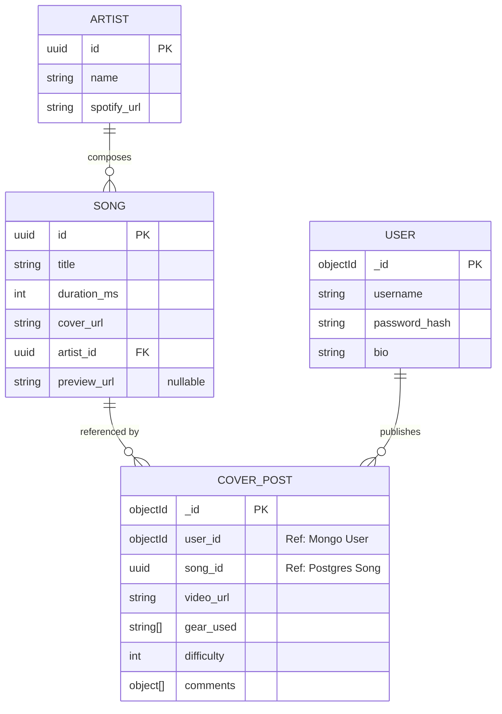

# RebelWay Guitar Gallery

*A microservices-based full-stack application initially designed as a personal guitar cover gallery, with an architecture ready to scale into a niche social media platform.*

The main goal of this project is to integrate **Kubernetes** and **Nginx** into the ecosystem, and to implement **polyglot persistence** combining **PostgreSQL** (for structured/immutable data) and **MongoDB** (for dynamic/document data) to serve different microservices within a single cohesive platform.

## Tech Stack & Technologies

*   **Frontend:** [Angular](https://angular.io) with Angular CLI, Bootstrap, and SCSS.
*   **Backend:** [Node.js](https://nodejs.org) and [Express.js](http://expressjs.com) (TypeScript).
*   **Databases (Polyglot):** 
    *   [PostgreSQL](https://www.postgresql.org/) (Relational Catalog via TypeORM).
    *   [MongoDB](https://www.mongodb.com/) (Dynamic Social Documents via Mongoose).
*   **Infrastructure & DevOps:** Docker, Kubernetes (K8s), and Nginx (Ingress/Reverse Proxy).
*   **External Integrations:** Spotify Web API (Track Metadata & Previews).
*   **Security:** JSON Web Token (JWT) and Bcrypt.js.

## Project Roadmap 

- [x] Initial system design and architecture planning (Mermaid ERD & Flowcharts).
- [x] Baseline cleanup and migration to a decoupled Client/Server structure.
- [ ] Containerize PostgreSQL and MongoDB environments using Docker Compose.
- [ ] Implement the Node.js backend with TypeORM and Mongoose.
- [ ] Develop the Angular frontend and integrate the Spotify Web API.
- [ ] Configure Nginx as a Reverse Proxy and API Gateway.
- [ ] Orchestrate the entire ecosystem using local Kubernetes (Minikube/Kind).

## Architecture

## Data Model

## Local Development Setup (WIP)
Note: Run instructions are currently being updated to reflect the new decoupled microservices architecture.

Clone the repository.

Initialize the frontend: cd client && npm install

Initialize the backend microservice: cd server && npm install

(Upcoming) Spin up the database containers via docker-compose up -d.

Author
Alejandro Rivada