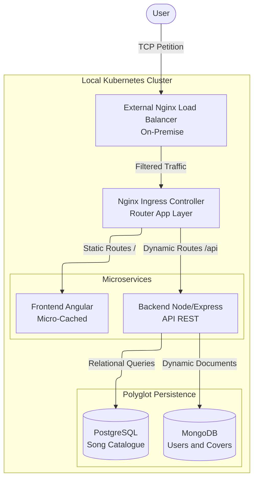
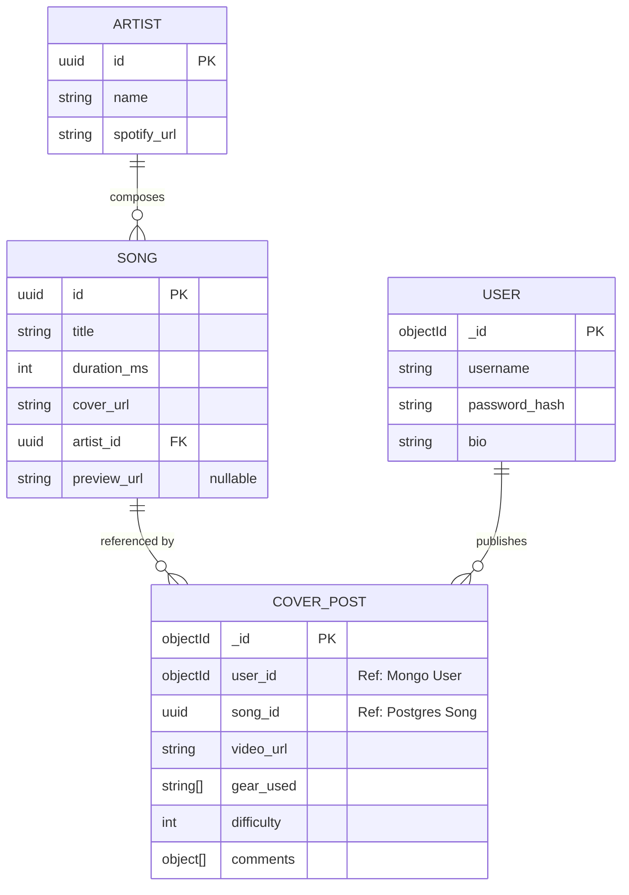

# RebelWay Guitar Gallery


*A microservices-based full-stack application initially designed as a personal guitar cover gallery, with an architecture ready to scale into a niche social media platform.*

The main goal of this project is to integrate **Kubernetes** and **Nginx** into the ecosystem, and to implement **polyglot persistence** combining **PostgreSQL** (for structured/immutable data) and **MongoDB** (for dynamic/document data) to serve different microservices within a single cohesive platform.

## Tech Stack & Technologies

*   **Frontend:** [Angular](https://angular.io) with Angular CLI, Bootstrap, and SCSS.
*   **Backend:** [Node.js](https://nodejs.org) and [Express.js](http://expressjs.com) (TypeScript).
*   **Databases (Polyglot):** 
    *   [PostgreSQL](https://www.postgresql.org/) (Relational Catalog via TypeORM).
    *   [MongoDB](https://www.mongodb.com/) (Dynamic Social Documents via Mongoose).
*   **Infrastructure & DevOps:** Docker, Kubernetes (K8s), and Nginx (Ingress/Reverse Proxy).
*   **External Integrations:** Spotify Web API (Track Metadata & Previews).
*   **Security:** JSON Web Token (JWT) and Bcrypt.js.

## Project Roadmap 

- [x] Initial system design and architecture planning (Mermaid ERD & Flowcharts).
- [x] Baseline cleanup and migration to a decoupled Client/Server structure.
- [x] Containerize PostgreSQL and MongoDB environments using Docker Compose.
- [ ] Implement the Node.js Spotify API backend with PostgreSQL.
- [ ] Integrate the Spotify Web API in the backend.
- [ ] Implement the Node.js Post backend with MongoDB.
- [ ] Develop the Angular frontend.
- [ ] Configure Nginx as a Reverse Proxy and API Gateway.
- [ ] Orchestrate the entire ecosystem using local Kubernetes (Minikube/Kind).

## Architecture



## Data Model



## Backend Folder Structure
```
app/
├── src/
│   ├── features/
│   │   ├── auth/            # All files related to user authentication
│   │   │   ├── auth.controller.ts   # Request handlers: process input and call 'auth' services
│   │   │   ├── auth.model.ts        # Database schemas and data models of 'auth' related
│   │   │   ├── auth.route.ts        # Define API endpoints of 'auth' and map them to controllers
│   │   │   └── auth.service.ts      # Core business logic; the "brain" of the 'auth' features
│   │   │
│   │   ├── users/           # All files related to user management
│   │   │   ├── user.controller.ts   # Request handlers: process input and call 'users' services
│   │   │   ├── user.model.ts        # Database schemas and data models of 'users' related
│   │   │   ├── user.route.ts        # Define API endpoints of 'users' and map them to controllers
│   │   │   └── user.service.ts      # Core business logic; the "brain" of the 'users features
│   │   │
│   │   └── product1,...,n/        # All files related to products
│   │       ├── product1.controller.ts  # Request handlers: process input and call 'product' services
│   │       ├── product1.model.ts       # Database schemas and data models of 'products' related
│   │       ├── product1.route.ts       # Define API endpoints of 'products' and map them to controllers
│   │       └── product1.service.ts     # Core business logic; the "brain" of the 'products' features
│   │
|   ├── api/                # API entry points (e.g., v1/)
│   ├── config/             # Centralized configuration files (DB, auth, etc.)
│   ├── middleware/         # Custom Express middleware (auth, logging, etc.)
│   ├── utils/              # Shared helper functions and reusable code
│   │
│   └── index.ts            # The main entry point for the application logic
|
├── tests/                  # All unit and integration tests
├── .env                    # All variable environments for App
├── .gitignore              # This file includes what are all file/ folders should not to move to your Git repo
├── package.json
├── server.ts               # Sets up and starts the server
└── tsconfig.json
```

## Local Development Setup (WIP)
Note: Run instructions are currently being updated to reflect the new decoupled microservices architecture.

Clone the repository.

Initialize the frontend: cd client && npm install

Initialize the backend microservice: cd server && npm install

(Upcoming) Spin up the database containers via docker-compose up -d.

Author
Alejandro Rivada